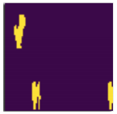
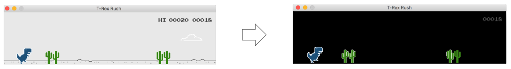
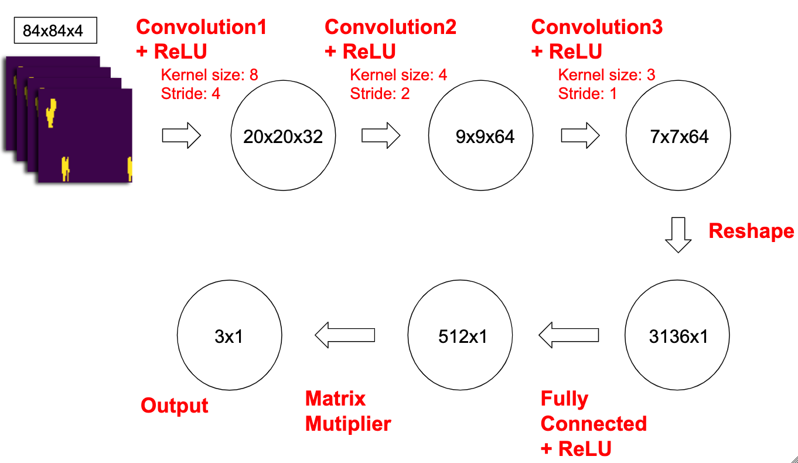
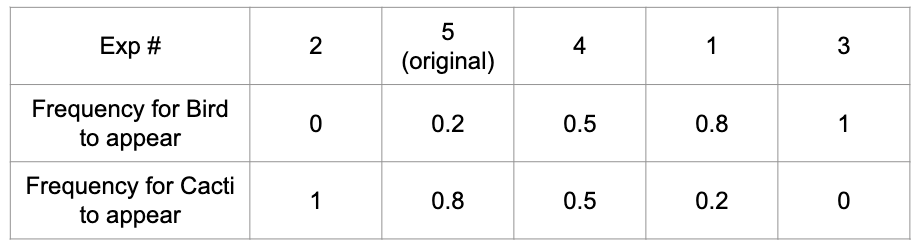
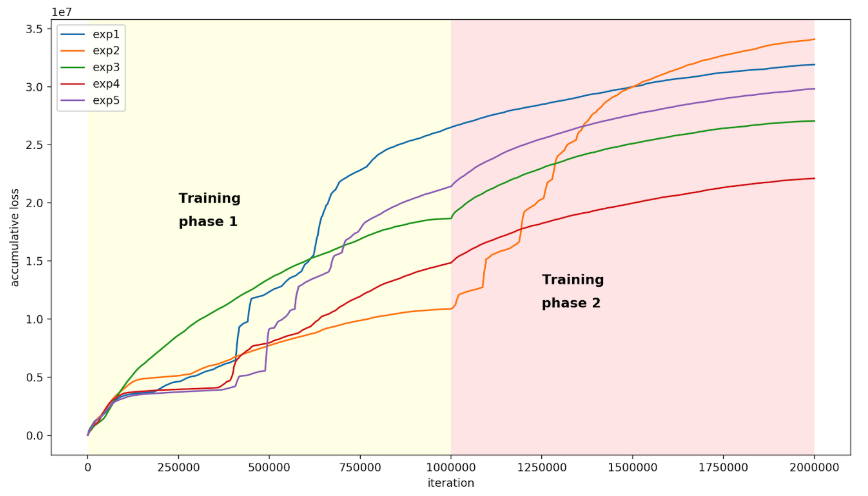

# Exploring deep reinforcement learning on T-Rex runner game and training with different pretrain settings
In this project, we first modularized all the setting on the T-Rex runner game and improved a step-by-step training of deep reinforcement learning. Secondly, We explored the T-Rex runner game.

During our preliminary training on the T-Rex runne game, we found a phenomenon in different settings. As the setting becomes more complicated, out model tends to learn more of the technic and will be able to handle a more complex situation either for future testing on different settings or keeping training on the different settings. In brief, we improved the T-Rex runner game, by experimenting on an interesting phenomenon of the effect and later performance of different settings for building a pre-train model.

## Get Started
**Train from scratch**:

`python3 dqn.py train`

**Train from pretrained model**

`python3 dqn.py keeptrain -m <path to model>`

**Test**

`python3 dqn.py test -m <path to model>`

## Experiment
### Preprocessing

For each image frame from the game, we will not directly use it, instead we crop the portion of image frame which is useful. Since T-Rex will not move on the image, only background will move, we crop image from the left with ratio 0.75, in other word, the original image size is (600, 150), after cropping image, the image size will be (450, 150). This way, we can obtain useful image for training.

In the next step, we convert the image to (84, 84) and make it becomes gray scale. The final input image will be like the first figure in this section. Also, since the original game has some useless background, for example, clouds, grass, and so on, we remove those trivial background to let our model only receive meaningful data. The final game will be like the second figure in this section.

### Network Architecture

First, we convert the image of the current game frame to binary and take the left half of it which is (300,150) in shape to reshape into (84, 84) frame. Then, we concatenate the image four times to form the input array. 

The architecture of our model is as follow. We havethree convolutional layers. The first layer convolves the input image of 84x84x4 to a convolution layer of 8x8 kernel and a stride size of 4. The output is then put through a ReLU layer. The second layer convolves with a 4x4 kernel at a stride of 2 and a ReLU layer. The third layer convolves with a 3x3 kernel at a stride of 1 and a ReLU layer. The last hidden layer consists of 512 fully connected layer and a ReLU layer. Finally, the output layer outputs three values. Each value represents the possibility of actions in this state. Output[0] is the score for doing nothing, output[1] is the score for jumping, output[3] is the score for ducking. 

Finally, we directly decide current movement decision base on these three values. We act as one of the action with the highest score. For example, if the output are [0.5, 0.1, 0.2], then the computer will choose to do nothing in this round.

### Training
* **Setting**:
We design 5 different strategies to train our model. We separate each experiment to two training phases, at the first phase, we try to set different frequency ratio for obstacles and train the model for one million iterations. As for the second phase, we will train the model with another one million iterations based on the original game setting, which is 0.8 and 0.2, for bird and cacti, respectively. The following figure is the setting of each experiments.

* **Result**:
The result of the five different settings for the pre-train setting of the game is interesting. We can see that for the first two million training iteration the experiment 3 and experiment 3 reach the highest score that is training and testing only on cactus or only on bird. However, entering the second two million iterations, the score for experiment 2 could not reach the top any more. However, the score of the last two million iterations for experiment 3 is still very good even though the settings are different. The following figure is the accumulative loss for each experiement.

## Reference
* [Chrome T-Rex Game](https://github.com/shivamshekhar/Chrome-T-Rex-Rush).
* [Reinforcement Learning - Learning how to play Flappy Bird in PyTorch](https://github.com/nevenp/dqn_flappy_bird).
* [Using Deep Q-Network to Learn How To Play Flappy Bird](https://java.ctolib.com/DeepLearningFlappyBird.html)
